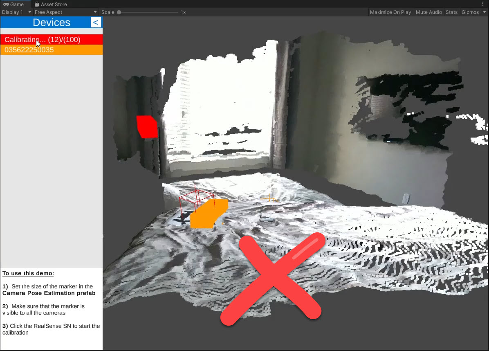

# Multi-camera Calibration for RealSense in Unity

|Not Calibrated| Calibrated |
|--|--|
|||

This is an example project showing how to align multiple **RealSense D400+** cameras using an April Tag inside of Unity. 

## Why was it created?

I have been using multiple Intel RealSense cameras for a few projects and wanted to create an alternative to using OpenCV.

Package Details
--------------------------
This project uses a custom version of [keijiro](https://github.com/keijiro)/**[jp.keijiro.apriltag](https://github.com/keijiro/jp.keijiro.apriltag)** project that can be found here: [ababilinski](https://github.com/ababilinski)/**[jp.keijiro.apriltag](https://github.com/ababilinski/jp.keijiro.apriltag)**
My changes to the package allow users to set some refinement variables as well as the field of view and center point.

Project outline
--------------------------
**An example of the alignment process:**

## Controls
|Key|Action|
|--|--|
| **Middle Mouse Button** | Pan |
| **Left Click** | Rotate|
| **Scroll** | Zoom|

--------------------------
### Setup
- Plugin your RealSense devices and print out marker (`Markers/full-page-marker.pdf`)
- Click **Play**
- Select the cameras you wish to align
- Click **Continue**
- Click on the camera Serial Number to start the alignment. (_the alignment finishes after 100 samples_)
--------------------------
#### Setup Images: camera selection

#### Setup Images: Scene

#### Setup Images: calibration Step

## Acknowledgements
Thank you to **Keijiro Takahashikeijiro** ([@keijiro]) for your open source projects. Your this could not have been done without your April Tags port to Unity. 

[@keijiro]: https://github.com/keijiro